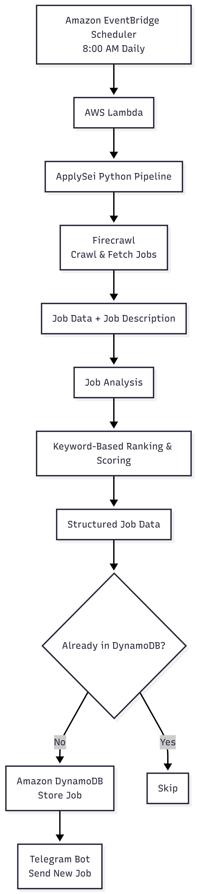
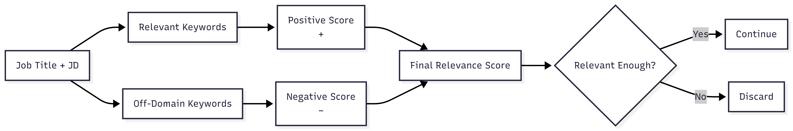
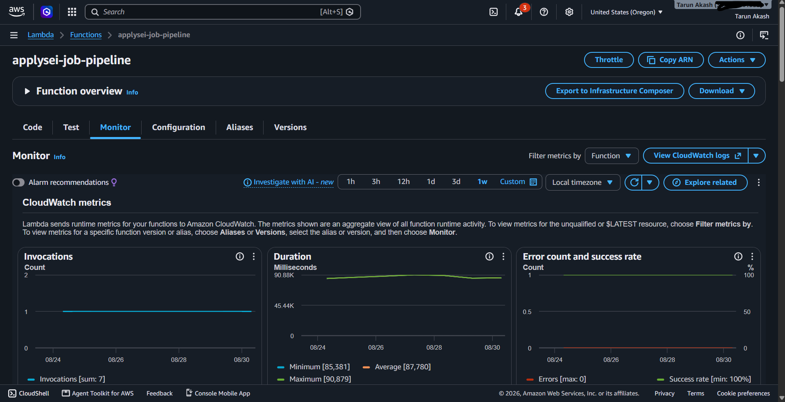
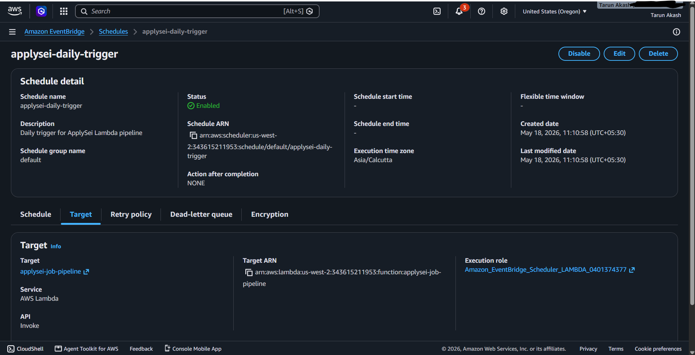
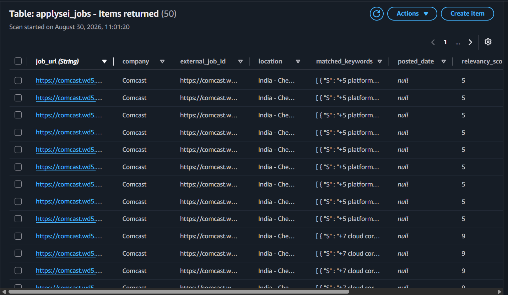

# ApplySei

### *By the Cloud. For the Cloud.*

ApplySei is a personal cloud job-search automation project I built to solve a problem I was experiencing myself.

## Why I Built It

There were three reasons behind ApplySei.

### 1. My previous cloud projects were expensive to keep alive

Some of my earlier cloud projects relied on infrastructure that continued to incur costs every month.

Eventually, I had to decommission them.

The problem wasn't that those projects weren't useful. They were.

But when the main point of a project is to demonstrate cloud infrastructure, keeping that infrastructure running indefinitely just for a portfolio doesn't always make financial sense.

So I wanted to build something that used cloud infrastructure **because it had a real purpose**, rather than keeping resources alive just to say I had deployed something.

### 2. The projects themselves were difficult to showcase

With my previous cloud projects, the most interesting part wasn't necessarily the application code.

It was the **infrastructure**.

There is only so much of that you can demonstrate through a GitHub repository. You can explain what each service does, but the actual project is often the way all those services work together.

I wanted to build something where the cloud infrastructure was not just supporting the project.

**The infrastructure was the project.**

And this time, I wanted something I could actually keep running and demonstrate.

### 3. My job search was painfully inefficient

While searching for Cloud, AWS, DevOps, SRE, and Infrastructure roles, I was spending a ridiculous amount of time checking career pages manually.

And I kept running into the same two problems.

I'd find a bunch of irrelevant jobs.

Or I'd find a role that looked perfect, spend 15–20 minutes going through the job description, analysing it, and deciding whether it was worth applying to...

Only to realise:

**I'd already applied to it.**

At some point, I thought:

> *Why am I manually doing this?*

So I decided to build something that could do the repetitive part for me.

Something that could find jobs, analyse them, score them based on relevance, remember what I'd already seen, and send the new ones directly to me.

That became **ApplySei**.

## What ApplySei Does

Every morning, ApplySei automatically searches for job opportunities from configured sources.

It then analyses the jobs, filters out irrelevant roles, scores the remaining opportunities based on keyword relevance, checks whether I've already seen the job, and sends new relevant opportunities directly to my Telegram.

In other words:

**I stopped searching for jobs manually and built something to search for them instead.**

---

# 2. How It Works — The Technical Side

There are two ways to understand how ApplySei works:

1. **The technical side** — how the different services and components work together.
2. **The simple side** — what actually happens when ApplySei runs, without all the technical terminology.

Let's start with the technical side.

## Overall Architecture

The complete architecture of ApplySei:

At a high level, the system follows this flow:

**EventBridge Scheduler → AWS Lambda → Python Pipeline → Firecrawl → Job Analysis & Scoring → DynamoDB + Telegram**

## The Components

### Amazon EventBridge Scheduler

EventBridge Scheduler starts the ApplySei pipeline automatically.

It is configured to trigger the Lambda function every day at **8:00 AM**.

### AWS Lambda

AWS Lambda runs the main ApplySei Python application.

When triggered, Lambda executes the complete pipeline — from fetching jobs to analysing, scoring, storing, and notifying.

Because the workload only needs to run once a day, there is no need to keep a server running continuously.

### Python

Python contains the core application logic.

It coordinates the different stages of the pipeline, including:

* Processing the data returned by Firecrawl
* Analysing job titles and descriptions
* Applying keyword-based filtering
* Calculating relevance scores
* Structuring job information
* Checking DynamoDB
* Sending Telegram notifications

### Firecrawl

Firecrawl handles **job discovery and data extraction**.

It crawls the configured career pages and returns the available job information and job descriptions to the Python pipeline.

Once the data is returned, Firecrawl's role is complete.

**Firecrawl collects the data. ApplySei decides what to do with it.**

---

## Inside the Job Processing Pipeline

The next diagram shows what happens after Firecrawl returns the job data:

The retrieved job information is passed to the Python application, where the actual analysis and scoring takes place.

### Job Analysis

The application analyses the job title and job description to determine how relevant the opportunity is to the roles I'm targeting.

The system is primarily focused on:

* Cloud
* AWS
* DevOps
* SRE
* Infrastructure
* Platform Engineering

### Keyword-Based Ranking & Scoring

ApplySei uses a **rule-based scoring system** rather than an LLM to rank jobs.

Relevant keywords contribute positively to the score, while keywords associated with unwanted domains or roles contribute negatively.

In simple terms:

**Relevant keyword → + score**

**Off-domain keyword → − score**

The final score determines whether a job is relevant enough to be included in the shortlist.

I intentionally chose a rule-based approach because the scoring should be:

* Predictable
* Explainable
* Cheap to operate
* Easy to modify

### Structured Job Data

Once a job has been analysed and scored, the relevant information is structured into a consistent format.

This allows jobs from different sources to be processed in the same way downstream.

The structured data then goes through the deduplication layer before notification.

### Amazon DynamoDB

DynamoDB provides the persistent memory for ApplySei.

It keeps track of jobs that have already been processed.

When the same job appears again:

**Already seen → Skip**

**New → Store + Continue**

This prevents duplicate notifications from filling up my Telegram.

### Telegram Bot API

Telegram is the final delivery layer.

New and relevant opportunities are sent directly to my Telegram bot, giving me a daily shortlist without manually checking every career page.

---

# 3. Okay, But Who Runs All This?

We've seen what the code does.

But there's one obvious question:

**Who actually runs the code?**

The answer is the infrastructure around it.

I didn't want to manually run a Python script every morning. The whole point was to automate the job search, so the infrastructure needed to take care of that too.

Here's what each part does, without getting too technical.

## AWS Lambda — The One Doing the Work

Think of Lambda as **the computer that runs my code when I need it**.

I don't keep a laptop or server running all day just for ApplySei.

Lambda runs the Python application, completes the work, and stops when the execution is finished.

Essentially:

> **"Here is my code. Run it when I need it."**

That's Lambda.

## EventBridge Scheduler — The Alarm Clock

If Lambda is the one doing the work, something needs to tell it **when** to start.

That's EventBridge Scheduler.

I configured it as an alarm clock for ApplySei:

**Every day → 8:00 AM → Wake up Lambda**

No manual trigger required.

## DynamoDB — The Memory

Imagine ApplySei finds the same job tomorrow that it found today.

I definitely don't want:

> *"Congratulations! Here's the same job you already saw yesterday."* 😭

So ApplySei needs a memory.

DynamoDB keeps track of the jobs that have already been processed.

When a new job comes in, ApplySei checks:

**"Have I seen this before?"**

If yes → ignore it.

If no → save it and continue.

## Telegram — The Messenger

Once ApplySei has finished all the work, I still need to know what it found.

That's where my Telegram bot comes in.

New and relevant jobs are sent directly to me.

So instead of opening multiple career pages every morning, I receive the shortlist directly.

## Putting It in Simple Terms

The infrastructure can basically be thought of as four people working together:

**EventBridge**
*"It's 8 AM. Time to get to work."*

↓

**Lambda**
*"Got it. I'll run the code."*

↓

**DynamoDB**
*"I've seen this job before." / "This one's new."*

↓

**Telegram**
*"Here's what I found."*

And somewhere in the middle, **Firecrawl goes out and actually looks for the jobs.**

That's the infrastructure behind ApplySei.

---

# 4. The Product Thinking Behind It

ApplySei started as a personal automation problem, but building it forced me to think beyond simply writing code.

The core product decisions were driven by a few simple questions.

### What problem am I actually solving?

Not:

> *"How do I scrape job postings?"*

But:

> **"How do I reduce the time and mental effort required to find relevant jobs?"**

### What information is actually useful?

Finding thousands of jobs isn't useful if most of them are irrelevant.

So the pipeline prioritises **relevance over volume**.

### What should the system remember?

A job staying online for weeks shouldn't result in the same notification every day.

Hence the deduplication layer.

### Does this need AI?

Not necessarily.

For this problem, a transparent rule-based scoring system was sufficient.

That made the system cheaper, easier to understand, and easier to change when my definition of a "good job" changes.

### Does this need a server running 24/7?

No.

The workload is periodic, so a scheduled serverless architecture made more sense.

---

## The Result

What started as:

**"I'm tired of checking career pages."**

became a working cloud system that:

* Runs automatically every morning
* Discovers job opportunities
* Analyses and scores them
* Filters irrelevant roles
* Remembers previously processed jobs
* Sends new opportunities directly to Telegram
* Runs on serverless AWS infrastructure

More importantly, it became a project I could actually keep running.

**I didn't build another job board.**

**I built a small personal recruiter that works for me.**

---

## Project Stack

**Cloud:** AWS Lambda, Amazon EventBridge Scheduler, Amazon DynamoDB, Amazon CloudWatch

**Application:** Python

**Data Discovery:** Firecrawl

**Notifications:** Telegram Bot API

**Approach:** Rule-based filtering and relevance scoring

**License:** MIT
